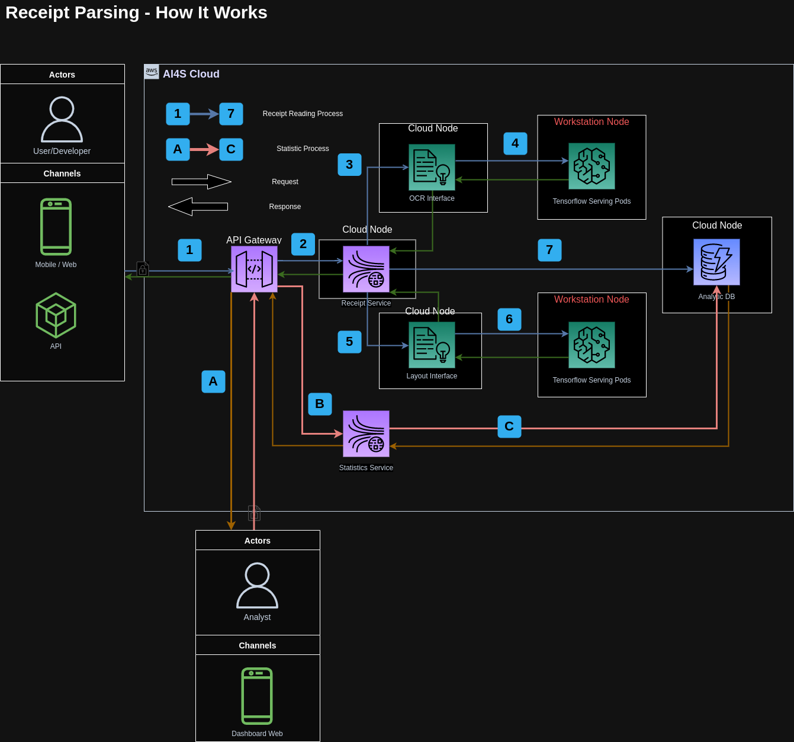

## Creating a hybrid cloud-on prem AI system

Over the last four months, a childhood friend of mine, who holds a PhD in Mass Communications and Markting and is presently employed at RMIT University, has made the bold choice to establish an AI company. Their primary mission is to develop solutions aimed at securing government funding. Given the high costs associated with deploying a full-scale AI infrastructure on the cloud, I've opted for a hybrid system as a cost-effective alternative.

The system must meet the following criteria:
- Ensuring high uptime
- Maintaining low operational costs
- Delivering fast response times
- Supporting easy integration and removal of models.


---

### Overall system design
To ensure high uptime, I decide to deploy a part of system on cloud, it acts as an AI interface: serves the request from frontend and execute API call to AI Workstation. Overall design will look like:



#### Some T-SQL Code

```tsql
SELECT This, [Is], A, Code, Block -- Using SSMS style syntax highlighting
    , REVERSE('abc')
FROM dbo.SomeTable s
    CROSS JOIN dbo.OtherTable o;
```

#### Some PowerShell Code

```powershell
Write-Host "This is a powershell Code block";

# There are many other languages you can use, but the style has to be loaded first

ForEach ($thing in $things) {
    Write-Output "It highlights it using the GitHub style"
}
```
